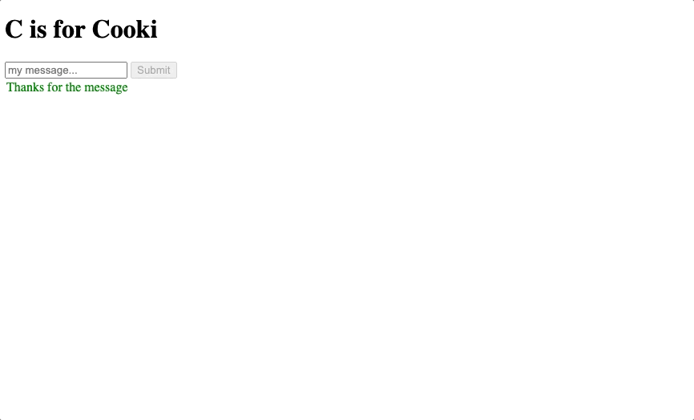

# Cooki

Create an API with two endpoints and a mini frontend.

## 1. `GET /token/:number` ✅

- this should receive a random number in the request params
- take that random number and generate a hash based on it
- save the generated hash along with a time when it was generated into your app memory (array of objects)
- set the generated hash as a cookie
- respond with just "ok"

## 2. `POST /message` ✅

- this should receive a request body with a message inside
- this should also receive cookies (start by reading the cookies from response)
- check the cookies for your hash
- if the hash is found, check that it is not older than 1 minute
- if the hash is not found or it is too old, respond with an HTTP 400
- if the hash is OK, respond with "thanks for the message"

## 3. Create a mini frontend ✅

- a single html page, no css, one text field, one button
- as the html page loads, use JavaScript to fetch a fresh token cookie from the backend
- your button should send the inputted text into the POST /message endpoint
  - the cookie *should* come along with the request...
  - let's see if we get it to work!
  - failure to get it to work is always an option, the important part is trying and learning!

## My solution

🐼
